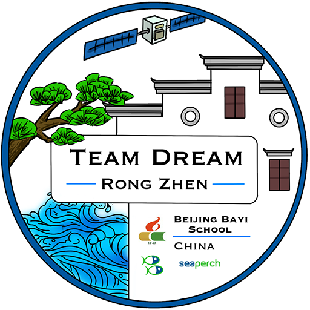

# 🌊 Team Dream Rongzhen (荣臻梦之队) Official Website

[English](README.md) | [简体中文](README_CN.md)

## 📖 About Us

Team Dream Rongzhen (荣臻梦之队) is a student team from Beijing Bayi School, dedicated to advancing underwater robotics technology. Our team focuses on innovative design and marine science exploration, continuously pushing the boundaries of technology through teamwork and perseverance.

## 🚀 Our Mission

We are committed to:
- Developing cutting-edge underwater robotics technology
- Exploring marine science and oceanography
- Promoting STEM education among youth
- Representing Chinese students' innovation in technology

## 🌟 Team Highlights

- **Team Captain**: Yueran Shen (沈跃然)
  - 7th grade student at Beijing Bayi School
  - 3 years of experience in SeaPerch competitions
  - Expert in technical design reports and ROV operation

## 🛠️ Website Features

Our official website showcases:
- Team introduction and achievements
- Deep sea exploration projects
- Marine knowledge resources
- Team member profiles
- Competition highlights

## 📱 Connect With Us

- **Bilibili**: [Team Dream Rongzhen](https://space.bilibili.com/3546600993458304)
- **Email**: yueran.shen@teamdream-byrz.xyz
- **WeChat**: [Scan QR Code](img/wxSPH.png)

## 💻 Technical Details

This is a static website built with:
- HTML5
- CSS3
- JavaScript
- Responsive design for all devices

## 📄 License

© 2024 Team Dream Rongzhen. All rights reserved.

## 👨‍💻 Developer

Website developed by [HungryHenry](http://hungryhenry.xyz)

---

*"Exploring the depths of the ocean, one innovation at a time"* 🌊🤖